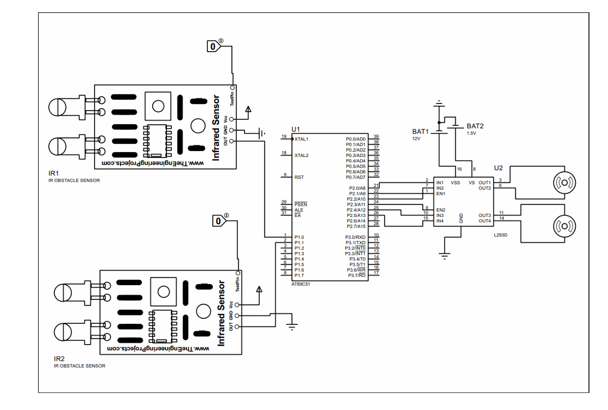

# 🚗 8051 Line Follower Robot

An autonomous line-following robot built using the AT89S52 (8051 microcontroller) and L293D motor driver.  
The system uses IR sensors to detect a path and control motor movement in real time.

---

## 🔧 Features

- Real-time line detection using IR sensors  
- Direction control (left, right, forward, stop)  
- Motor driving using L293D H-bridge  
- Assembly-level control using 8051 microcontroller  
- Compact hardware implementation on perf-board  

---

## 🧠 Working Principle

The robot uses two IR sensors to detect contrast between the line and background:

- Both sensors on white → Move forward  
- Left sensor on line → Turn left  
- Right sensor on line → Turn right  
- Both sensors on line → Stop  

The microcontroller processes sensor inputs and controls motors via the L293D driver.

---

## ⚙️ Components Used

- AT89S52 (8051 Microcontroller)  
- L293D Motor Driver IC  
- IR Sensors (2)  
- DC Motors (2)  
- 7805 Voltage Regulator  
- Battery (7–12V)  
- Chassis + Wheels  

---

## 🖥️ Code

The control logic is implemented in **8051 Assembly**, handling:
- Sensor input reading  
- Decision making  
- Motor control  

---

## 🔌 Circuit Diagram

---

## 🚀 How to Run

1. Assemble the circuit as per the diagram  
2. Upload the assembly code to AT89S52  
3. Place the robot on a track  
4. Power ON  

---

## 📌 Future Improvements

- Implement PWM for speed control  
- Add PID-based control for smoother tracking  
- Use multi-sensor array for better accuracy  

---

## 📷 Demo

*(Add images or video of your robot here)*

---

## 👤 Author

Srija  
